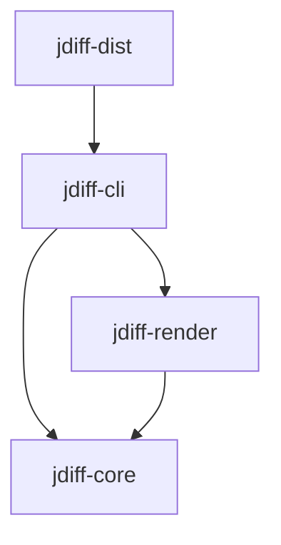
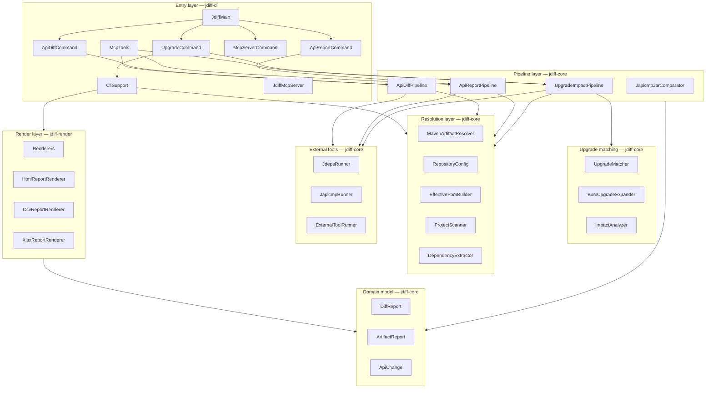
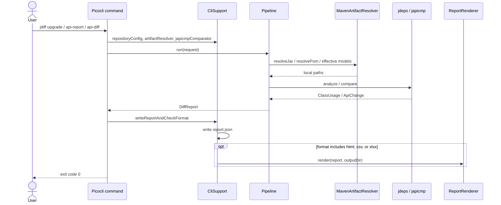
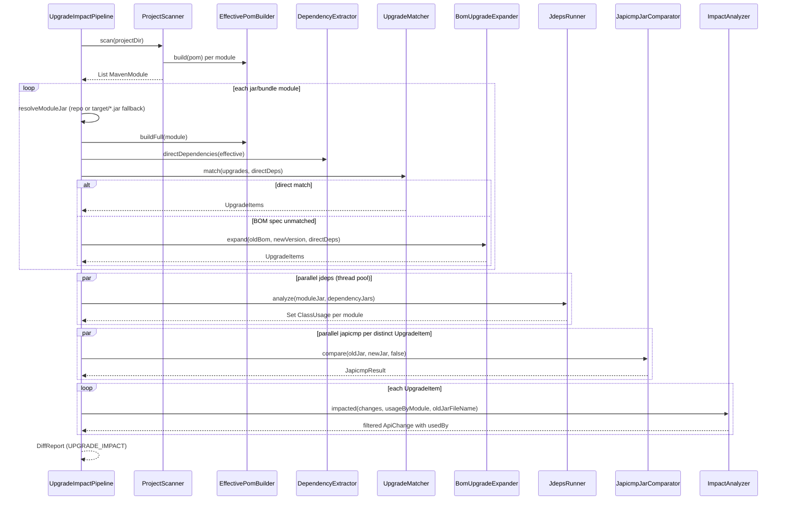
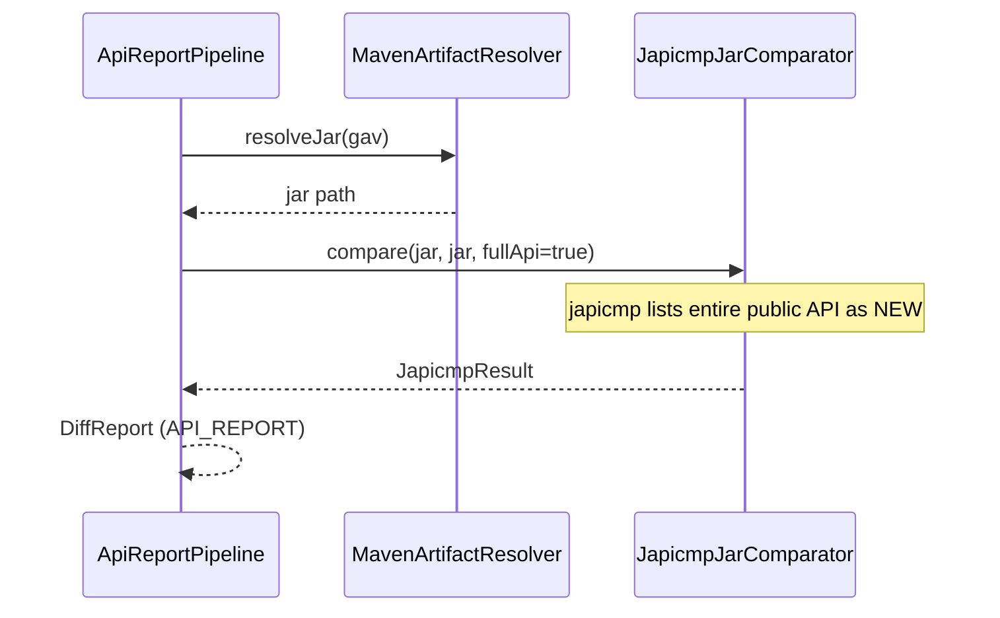
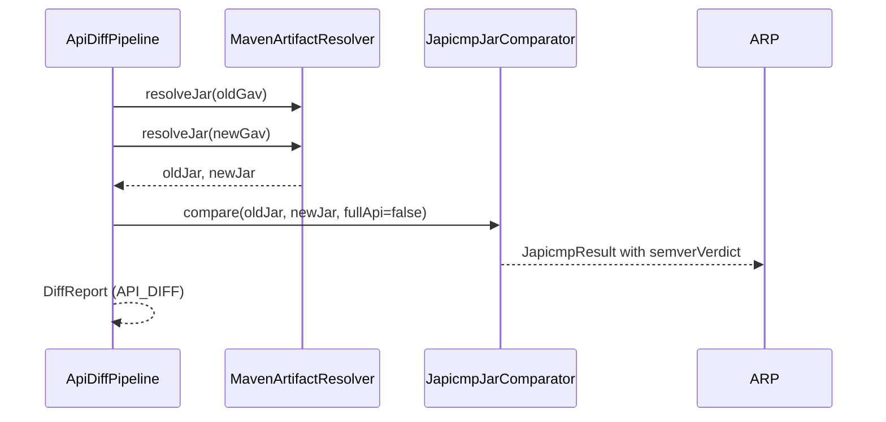
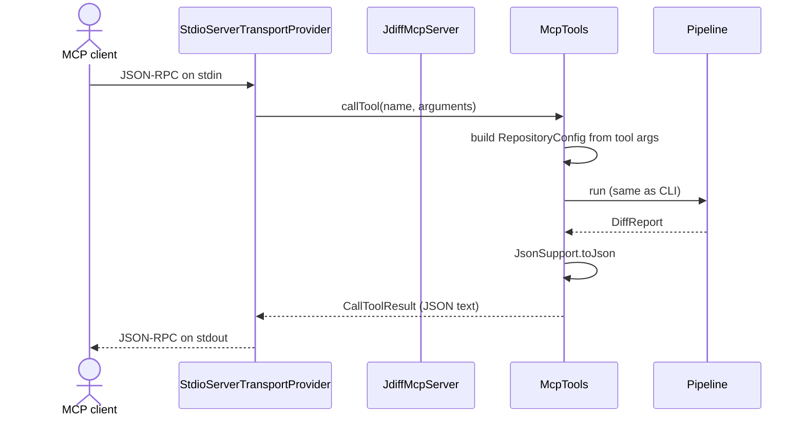

# jdiff — High-Level Design

This document describes the architecture of **jdiff**: a Java tool that analyzes dependency upgrade impact,
generates API inventory reports, and compares API changes between jar versions. It is intended for developers
integrating, extending, or operating the tool.

## 1. Purpose and scope

jdiff answers three related questions for Maven-based Java projects:

| Mode | CLI command | Question |
| ---- | ----------- | -------- |
| Upgrade impact | `upgrade` | If I bump dependency X (or a BOM), which API changes in X actually affect **my** code? |
| API report | `api-report` | What is the full public API surface of jar version V? |
| API diff | `api-diff` | What changed in the public API between version A and B? |

Upgrade impact is the differentiator: it combines **jdeps** (who calls what at the class level) with
**japicmp** (what changed in the dependency API) and keeps only changes that intersect real usage.

Out of scope: dependency tree resolution beyond direct dependencies for upgrade matching, transitive impact
propagation, non-Maven build systems, and IDE plugins.

## 2. Maven module layout

```
jdiff-parent (pom)
├── jdiff-core      — domain logic, pipelines, Maven resolution, external tool runners (embeddable library)
├── jdiff-render    — HTML / CSV / XLSX renderers over the unified JSON model
├── jdiff-cli       — Picocli entry point, MCP server, shared CLI plumbing
└── jdiff-dist      — distribution zip (fat jar, japicmp, launchers, README)
```

Dependency direction (compile-time):



| Module | Responsibility |
| ------ | -------------- |
| **jdiff-core** | All analysis logic; no Picocli, no FreeMarker. Safe to embed in other JVM applications. |
| **jdiff-render** | Presentation layer: turns `DiffReport` into human-readable files. |
| **jdiff-cli** | User-facing entry points (CLI subcommands, MCP stdio server), wiring core + render. |
| **jdiff-dist** | Packaging only: assembly descriptor, `jdiff.bat` / `jdiff.sh`, copies README and japicmp. |

## 3. Layered architecture



### 3.1 Entry layer (`jdiff-cli`)

| Class | Responsibility |
| ----- | -------------- |
| `JdiffMain` | Root Picocli command; registers subcommands; applies `--log-level` to Logback before execution. |
| `UpgradeCommand` | Parses `--project` / `--gav`, `--upgrade` / `--upgrades-file`; builds `UpgradeImpactPipeline`; writes output. |
| `ApiReportCommand` | Parses `--gav`; runs `ApiReportPipeline`. |
| `ApiDiffCommand` | Parses `--gav`, `--old`, `--new`; runs `ApiDiffPipeline`. |
| `McpServerCommand` | Starts `JdiffMcpServer` on stdio. |
| `OutputOptions` | Shared mixin: `--output-dir`, `--format`, `--repo`, `--settings`, `--japicmp-jar`, `--threads`. |
| `CliSupport` | Factory methods: `RepositoryConfig`, `ArtifactResolver`, `JapicmpJarComparator`; japicmp jar discovery; `writeReportAndCheckFormat`. |
| `JdiffMcpServer` | MCP transport over stdio; EOF-aware shutdown; registers three tools from `McpTools`. |
| `McpTools` | MCP tool specs wrapping the same pipelines as CLI; japicmp path from `JDIFF_JAPICMP_JAR` env var. |

All analysis subcommands produce a **`DiffReport`**, serialize it to **`report.json`**, then optionally render
additional formats.

### 3.2 Pipeline layer (`jdiff-core`)

| Class | Responsibility |
| ----- | -------------- |
| `UpgradeImpactPipeline` | Orchestrates the full upgrade-impact workflow (see §5.1). |
| `ApiReportPipeline` | Resolves one jar; runs japicmp in “full API” mode (old jar = new jar). |
| `ApiDiffPipeline` | Resolves two jar versions; runs japicmp diff mode. |
| `JarComparator` | Interface: `compare(oldJar, newJar, fullApi)`. |
| `JapicmpJarComparator` | Runs `JapicmpRunner`, parses XML via `JapicmpXmlParser`, returns `JapicmpResult`. |
| `UpgradeRequest` | Immutable input: project directory *or* single target GAV, plus list of `UpgradeSpec`. |

Pipelines are **stateless services** constructed per CLI invocation with injected collaborators (resolver,
jdeps, comparator, thread pool size).

### 3.3 Upgrade matching (`jdiff-core`)

| Class | Responsibility |
| ----- | -------------- |
| `UpgradeSpec` | Parsed `groupId:artifactId=newVersion` from CLI or upgrades file. |
| `UpgradeItem` | Concrete old→new version pair for one artifact after matching or BOM expansion. |
| `UpgradeMatcher` | Matches requested upgrades against a module's **direct** dependencies by GA. |
| `BomUpgradeExpander` | Given an import-scoped BOM upgrade, expands to per-dependency `UpgradeItem`s whose managed versions change. |
| `ImpactAnalyzer` | Filters japicmp `ApiChange` list to entries whose class is referenced by jdeps usage; attaches `usedBy` refs. |

BOM expansion logic: locate the import BOM in the module's **raw model lineage** (module + ancestors),
resolve its current version, load old and new BOM effective models, and diff managed versions against the
module's direct dependencies.

### 3.4 Resolution layer (`jdiff-core`)

| Class | Responsibility |
| ----- | -------------- |
| `ArtifactResolver` | Interface: `resolveJar(Gav)`, `resolvePom(Gav)`. |
| `MavenArtifactResolver` | Eclipse Aether-based download into the local repository; attaches auth from `RepositoryConfig`. |
| `RepositoryConfig` | Built from `--repo` URLs and optional `--settings`; reads `<localRepository>` and `<servers>`. |
| `ServerCredentials` | Username/password pair keyed by Maven server id. |
| `RemoteRepo` | Remote repository id + URL. |
| `EffectivePomBuilder` | Builds effective Maven models from a local `pom.xml` or a remote BOM/jar POM via the resolver. |
| `ResolverModelResolver` | Bridges Maven Model Builder to Aether for parent/BOM resolution. |
| `ProjectScanner` | Recursively walks `<modules>`; yields `MavenModule` (GAV, pom path, packaging, optional `target/*.jar`). |
| `DependencyExtractor` | Lists direct compile/runtime/provided dependencies from an effective model with resolved versions. |
| `ResolvedDependency` | GAV + scope + optional flag. |
| `MavenModule` | One module discovered by the scanner. |

Upgrade impact analyzes only **jar/bundle** packaging modules. Unresolvable module jars are skipped when no
local `target/*.jar` fallback exists.

### 3.5 External tool integration (`jdiff-core`)

| Class | Responsibility |
| ----- | -------------- |
| `ExternalToolRunner` | Runs a subprocess with timeout; captures stdout/stderr into `ToolResult`. |
| `ToolResult` | Exit code, streams, duration; `success()` when exit code is 0. |
| `JdkTools` | Locates JDK binaries (`jdeps`) from `JAVA_HOME` or `PATH`. |
| `JdepsRunner` | Invokes `jdeps -verbose:class --ignore-missing-deps --multi-release base`; Windows long-classpath workaround via manifest stub jar. |
| `JdepsOutputParser` | Parses jdeps line-oriented output into `ClassUsage` records. |
| `ClassUsage` | One edge: owner class → used class, tagged with provider jar file name. |
| `JapicmpRunner` | Invokes external japicmp jar; writes XML report to a temp file. |
| `JapicmpXmlParser` | Maps japicmp XML to `ApiChange` list and semver verdict. |
| `JapicmpOptions` | CLI flags for full-API vs diff mode. |
| `JapicmpResult` | Parsed changes + optional semver verdict. |

japicmp is **not** bundled inside the fat jar; it ships beside jdiff in the distribution zip or is passed via
`--japicmp-jar`.

### 3.6 Domain model (`jdiff-core`)

| Type | Responsibility |
| ---- | -------------- |
| `DiffReport` | Top-level report: tool metadata, `ReportMode`, `input` map, list of `ArtifactReport`. |
| `ReportMode` | `UPGRADE_IMPACT`, `API_REPORT`, `API_DIFF`. |
| `ArtifactReport` | One upgraded or analyzed artifact: coordinates, versions, semver verdict, changes. |
| `ApiChange` | Single API element change (class/method/field) with japicmp compatibility metadata. |
| `UsageRef` | Consumer module id + list of owner classes (upgrade impact only). |
| `Gav` | Immutable groupId:artifactId:version[:classifier]. |
| `JsonSupport` | Jackson serialization for `DiffReport`. |

JSON is the **canonical interchange format**; HTML/CSV/XLSX are projections of the same structure.

### 3.7 Render layer (`jdiff-render`)

| Class | Responsibility |
| ----- | -------------- |
| `ReportRenderer` | Interface: `render(DiffReport, Path outputFile)`, `fileName()`. |
| `Renderers` | Factory registry for `html`, `csv`, `xlsx`. |
| `HtmlReportRenderer` | FreeMarker template `report.ftl`; passes plain maps (not Java records) to the template. |
| `CsvReportRenderer` | Flattened change rows via Apache Commons CSV. |
| `XlsxReportRenderer` | Multi-sheet workbook via Apache POI. |

Rendering happens **after** pipeline completion, inside `CliSupport.writeReportAndCheckFormat`.

## 4. End-to-end request flow (CLI)



## 5. Pipeline internals

### 5.1 Upgrade impact sequence



**Parallelism:** jdeps runs per module in a fixed thread pool (`--threads`, default from `OutputOptions`).
japicmp comparisons run in parallel per distinct `UpgradeItem`. Module discovery and upgrade matching are
sequential.

**Failure behavior:** a jdeps failure for one module aborts the whole run. Unmatched upgrade specs produce
WARN logs but do not fail the run. Modules without a resolvable jar are skipped.

### 5.2 API report sequence



### 5.3 API diff sequence



## 6. MCP server architecture



Constraints:

- **stdout** carries MCP protocol only; Logback is configured to log to **stderr** (`logback.xml`).
- stdin EOF (via `EofWatchingInputStream`) triggers graceful shutdown.
- Three tools: `generate_api_report`, `generate_api_diff`, `upgrade_impact` — parameter shapes mirror CLI
  inputs.

## 7. Data model (JSON)

Every run emits the same top-level envelope:

```json
{
  "tool": "jdiff",
  "toolVersion": "0.1.0-SNAPSHOT",
  "mode": "upgrade-impact",
  "generatedAt": "2026-08-07T09:57:53.476Z",
  "input": { },
  "artifacts": [ ]
}
```

| Field | Content by mode |
| ----- | --------------- |
| `input` | Upgrade: project path, requested upgrades, modules analyzed, unmatched upgrades, change counts. API modes: GAV and versions. |
| `artifacts[]` | One entry per upgraded or analyzed dependency. |
| `artifacts[].changes[]` | `ApiChange` entries; `usedBy` populated only in upgrade-impact mode. |

Renderers consume `DiffReport` in memory; they do not re-parse JSON from disk.

## 8. Configuration surface

| Source | Effect |
| ------ | ------ |
| `--repo` (repeatable) | Remote Maven repositories; ids `repo0`, `repo1`, … assigned in order. |
| `--settings` | Optional `settings.xml`: local repo path + server credentials matched by repo id. |
| `--japicmp-jar` | Explicit japicmp fat jar path; else scan next to running jar or `./japicmp/`. |
| `--threads` | jdeps parallelism in upgrade mode. |
| `--format` | `json` (always written), plus optional `html`, `csv`, `xlsx`. |
| `--log-level` | Logback root level: INFO, DEBUG, TRACE, NOLOGS. |
| `JDIFF_JAPICMP_JAR` | MCP-only japicmp path override. |

Default remote repository when no `--repo` is given: Maven Central.

## 9. Distribution layout

The `jdiff-dist` assembly produces a zip:

```text
jdiff-<version>/
├── jdiff.jar              # shaded CLI fat jar
├── japicmp-0.26.1-jar-with-dependencies.jar
├── jdiff.bat
├── jdiff.sh
└── README.md
```

Launchers invoke `java -jar jdiff.jar <subcommand> …` with `JAVA_HOME`/`PATH` providing `jdeps`.

## 10. Testing strategy (overview)

| Layer | Test type | Location |
| ----- | --------- | -------- |
| Parsers (`JdepsOutputParser`, `JapicmpXmlParser`) | Unit tests with fixture files | `jdiff-core/src/test` |
| Upgrade matching, BOM expansion | Unit tests | `jdiff-core/src/test` |
| `RepositoryConfig`, resolver | Unit tests with stub settings | `jdiff-core/src/test` |
| CLI commands | Picocli execution tests | `jdiff-cli/src/test` |
| MCP tools | Tool handler tests with fake pipelines | `jdiff-cli/src/test` |
| End-to-end (optional) | `*IT` with `-Djdiff.it=true` | integration tests against real jars |

External tools (jdeps, japicmp) are exercised in integration tests; unit tests mock `ExternalToolRunner` or
use captured output fixtures.

## 11. Extension points

| Extension | How |
| --------- | --- |
| Embed in another JVM app | Depend on `jdiff-core`; construct pipelines directly with custom `ArtifactResolver` or `JarComparator`. |
| New output format | Implement `ReportRenderer`; register in `Renderers.FACTORIES`. |
| Custom repository auth | Provide `RepositoryConfig` programmatically or extend settings parsing. |
| Alternative API diff engine | Implement `JarComparator`; inject into pipelines. |
| CI / agent integration | Use CLI JSON output or MCP stdio server. |

## 12. Known limitations

- Upgrade matching considers **direct dependencies only** (plus BOM-managed versions for those deps).
- Transitive dependency version changes without a direct dep version change are not modeled unless a BOM
  expansion covers them.
- Effective POM building approximates Maven (Model Builder + Resolver); edge-case POM features may differ from
  a full `mvn` build.
- jdeps usage analysis requires resolvable dependency jars on the classpath; missing jars are excluded with a
  WARN.
- Module jars must exist locally (repo or `target/*.jar`) for upgrade impact; unpublished application modules
  are skipped.

## 13. Related documents

| Document | Description |
| -------- | ----------- |
| [README.md](README.md) | User-facing overview, quick start, CLI reference |
| [demo/DEMO-GUIDE.md](demo/DEMO-GUIDE.md) | Manual step-by-step demo commands for Qubership artifacts |
