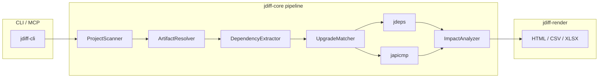

# jdiff

Analyze the impact of Java dependency upgrades, generate API documentation, and compare API changes between
Maven artifact versions.

## What is jdiff

Upgrading Java dependencies is risky: a minor version bump can remove or change public API surface that your
code still calls. **jdiff** helps you upgrade safely by answering two related questions:

1. **Upgrade impact** — for a Maven project (or a single jar), which API changes in upgraded dependencies
   actually affect classes your code uses? jdiff intersects **jdeps** usage analysis with **japicmp** API diffs.
2. **Standalone API analysis** — for any Maven jar, produce a full API inventory or a semver-classified diff
   between two versions, without scanning a consumer project.

Reports are machine-readable JSON plus optional human-readable HTML, CSV, or XLSX.

## Capabilities

| Mode | CLI subcommand | Purpose |
| ---- | -------------- | ------- |
| Upgrade impact | `upgrade` | jdeps ∩ japicmp for a project or single artifact |
| API report | `api-report` | Full API inventory of one jar version |
| API diff | `api-diff` | API changes between two versions of one artifact |
| MCP server | `mcp-server` | Same three operations as MCP tools over stdio |

**Report formats:** `json` (default, always written to `--output-dir/report.json`), `html`, `csv`, `xlsx`.
Combine with `--format json,html`.

**Log levels** (`--log-level`, global): `INFO` (default), `DEBUG`, `TRACE`, `NOLOGS`. Logs go to stderr;
stdout is reserved for JSON (when `--format json` only) or MCP traffic.

## Architecture

jdiff is organized in three layers:

1. **CLI / MCP facade** (`jdiff-cli`) — picocli commands and MCP stdio server.
2. **Core pipeline** (`jdiff-core`) — reusable analysis engine (embeddable; future REST microservice).
3. **Rendering** (`jdiff-render`) — HTML, CSV, XLSX output from the unified JSON model.



**Pipeline stages (upgrade mode):** `ProjectScanner` → `ArtifactResolver` → `DependencyExtractor` (incl. BOM
expansion) → `UpgradeMatcher` → parallel jdeps + japicmp → `ImpactAnalyzer` → unified JSON model.

| Module | Role |
| ------ | ---- |
| `jdiff-core` | Resolver, jdeps/japicmp runners, pipelines, JSON model — embeddable library |
| `jdiff-render` | Report renderers (FreeMarker, commons-csv, Apache POI) |
| `jdiff-cli` | Picocli entry point, MCP server, shared output options |
| `jdiff-dist` | Distribution zip with fat jar, japicmp, launchers, README |

## Prerequisites

- **JDK 21+** — provides `jdeps` on `PATH` via `$JAVA_HOME/bin`.
- **japicmp fat jar** — bundled next to `jdiff.jar` in the distribution zip, or pass `--japicmp-jar`.
- **Network** — Maven Central by default; add `--repo` for additional repositories (e.g. GitHub Packages for
  Netcracker/Qubership artifacts). `--settings` supports `<localRepository>` only (mirrors/servers are not read).

## Build

From the repository root:

```bash
mvn package
```

Artifacts:

| Output | Location |
| ------ | -------- |
| Fat jar | `jdiff-cli/target/jdiff-cli-<version>-all.jar` |
| Distribution zip | `jdiff-dist/target/jdiff-<version>-dist.zip` |

Run tests:

```bash
mvn verify
```

Integration / end-to-end tests (network + japicmp jar under `japicmp/`):

```bash
mvn verify -Djdiff.it=true -Dtest=*IT
```

## Usage

Global options (all analysis subcommands): `--output-dir`, `--format`, `--repo`, `--settings`, `--japicmp-jar`,
`--threads`, `--log-level`.

**Exit codes:** `0` success, `1` runtime/analysis failure, `2` invalid arguments or unsupported format.

### Upgrade impact

Analyze which API changes in upgraded dependencies affect your project.

Windows:

```bat
jdiff.bat upgrade ^
  --project C:\path\to\project ^
  --upgrade com.example:lib-a=2.0.0 ^
  --upgrade com.example:lib-b=3.1.0 ^
  --output-dir reports\upgrade ^
  --format json,html
```

Linux/macOS:

```bash
./jdiff.sh upgrade \
  --project /path/to/project \
  --upgrade com.example:lib-a=2.0.0 \
  --upgrade com.example:lib-b=3.1.0 \
  --output-dir reports/upgrade \
  --format json,html
```

Mode-specific flags: `--project` *or* `--gav`, `--upgrade` (repeatable), `--upgrades-file`.

Sample JSON (trimmed):

```json
{
  "tool": "jdiff",
  "mode": "upgrade-impact",
  "input": { "project": "/path/to/project", "upgrades": ["com.example:lib-a=2.0.0"] },
  "artifacts": [{
    "groupId": "com.example",
    "artifactId": "lib-a",
    "oldVersion": "1.0.0",
    "newVersion": "2.0.0",
    "semverVerdict": "MAJOR",
    "changes": [{
      "className": "com.example.LegacyApi",
      "status": "REMOVED",
      "breaking": true,
      "semver": "MAJOR",
      "usedBy": [{ "module": "my-service", "className": "com.my.App" }]
    }]
  }]
}
```

### API report

Full API inventory for one Maven coordinate.

```bat
jdiff.bat api-report --gav info.picocli:picocli:4.7.7 --output-dir reports\api --format json,html
```

```bash
./jdiff.sh api-report --gav info.picocli:picocli:4.7.7 --output-dir reports/api --format json,html
```

Mode-specific flag: `--gav` (`groupId:artifactId:version`).

### API diff

Compare two versions of the same artifact.

```bat
jdiff.bat api-diff --gav org.apache.commons:commons-csv --old 1.11.0 --new 1.12.0 --output-dir reports\diff
```

```bash
./jdiff.sh api-diff --gav org.apache.commons:commons-csv --old 1.11.0 --new 1.12.0 --output-dir reports/diff
```

Mode-specific flags: `--gav` (`groupId:artifactId`), `--old`, `--new`.

### MCP server

```bash
java -jar jdiff.jar mcp-server
```

Or use `jdiff.bat mcp-server` / `./jdiff.sh mcp-server` from the distribution folder.

## MCP server

Register in an MCP client (example):

```json
{
  "mcpServers": {
    "jdiff": {
      "command": "java",
      "args": ["-jar", "/path/to/jdiff.jar", "mcp-server"],
      "env": {
        "JDIFF_JAPICMP_JAR": "/path/to/japicmp-0.26.1-jar-with-dependencies.jar"
      }
    }
  }
}
```

Place `japicmp-*.jar` next to `jdiff.jar` to omit `JDIFF_JAPICMP_JAR`.

| Tool | Required inputs | Optional inputs |
| ---- | --------------- | --------------- |
| `generate_api_report` | `gav` (`groupId:artifactId:version`) | `repositories[]` |
| `generate_api_diff` | `gav` (`groupId:artifactId`), `oldVersion`, `newVersion` | `repositories[]` |
| `upgrade_impact` | `upgrades[]` (`groupId:artifactId=newVersion`) | `project` *or* `gav`, `repositories[]`, `threads` |

Each tool returns the unified JSON report as tool result text.

## Report format

Every run produces a top-level envelope:

| Field | Meaning |
| ----- | ------- |
| `tool` | Always `"jdiff"` |
| `toolVersion` | jdiff release version |
| `mode` | `upgrade-impact`, `api-report`, or `api-diff` |
| `generatedAt` | ISO-8601 timestamp |
| `input` | Mode-specific inputs (GAVs, versions, upgrades) |
| `artifacts[]` | Per-artifact results |

Each `artifacts[]` entry contains `groupId`, `artifactId`, `oldVersion`, `newVersion`, `semverVerdict`, and
`changes[]`.

Each `changes[]` entry:

| Field | Semantics |
| ----- | --------- |
| `className` | Fully qualified type |
| `elementType` | `CLASS`, `METHOD`, `FIELD`, … |
| `member` | Signature or `null` for type-level |
| `status` | `NEW`, `REMOVED`, `MODIFIED`, `UNCHANGED` |
| `changeTypes` | japicmp compatibility codes |
| `details` | Human-readable summary of changes not covered by `changeTypes` (e.g. class file format version) |
| `breaking` | Whether the change is breaking |
| `semver` | Per-change semver impact |
| `usedBy` | Consumer refs — populated in **upgrade-impact** mode only |

Annotated example:

```json
{
  "tool": "jdiff",
  "toolVersion": "0.1.0-SNAPSHOT",
  "mode": "api-diff",
  "generatedAt": "2026-08-07T10:00:00Z",
  "input": {
    "gav": "org.apache.commons:commons-csv",
    "oldVersion": "1.11.0",
    "newVersion": "1.12.0"
  },
  "artifacts": [{
    "groupId": "org.apache.commons",
    "artifactId": "commons-csv",
    "oldVersion": "1.11.0",
    "newVersion": "1.12.0",
    "semverVerdict": "MINOR",
    "changes": [{
      "className": "org.apache.commons.csv.CSVFormat",
      "elementType": "METHOD",
      "member": "builder()",
      "status": "MODIFIED",
      "breaking": false,
      "semver": "NONE",
      "usedBy": null
    }]
  }]
}
```

## Demo scenarios

Runnable scripts live under [`demo/`](demo/). Build first with `mvn -q package -DskipTests`, then:

| Script | Demonstrates |
| ------ | ------------ |
| `demo/mode1-upgrade-impact.ps1` / `.sh` | Upgrade impact on [qubership-integration-platform](https://github.com/Netcracker/qubership-integration-platform) |
| `demo/mode2-api-report.ps1` / `.sh` | API reports for two [qubership-core-java-libs](https://github.com/Netcracker/qubership-core-java-libs) jars |
| `demo/mode3-api-diff.ps1` / `.sh` | API diffs for the same two artifacts (old ≈ one year behind latest) |

Scripts use `demo/work/` for clones and downloads, `demo/out/<scenario>/` for reports. Qubership artifacts are
hosted on [GitHub Packages](https://maven.pkg.github.com/Netcracker/*); prefetch via `gh auth token` (needs
`read:packages`) before running jdiff — see script comments.

## Dependencies and acknowledgements

**Libraries:** [picocli](https://picocli.info/), [Apache Maven Resolver](https://maven.apache.org/resolver/),
[Jackson](https://github.com/FasterXML/jackson), [Logback](https://logback.qos.ch/),
[Apache POI](https://poi.apache.org/), [Apache Commons CSV](https://commons.apache.org/proper/commons-csv/),
[FreeMarker](https://freemarker.apache.org/), [MCP Java SDK](https://github.com/modelcontextprotocol/java-sdk).

**External tools:**

- [jdeps](https://docs.oracle.com/en/java/javase/21/docs/specs/man/jdeps.html) — bundled with the JDK
- [japicmp](https://github.com/siom79/japicmp) — bundled in the distribution zip (v0.26.1)
